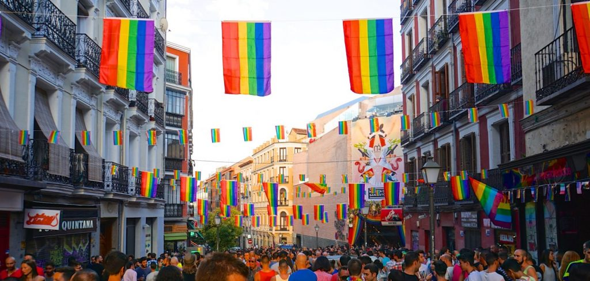

<h1>A Map of Spain</h1>

This is a map of Spain's 17 autonomous regions. Click the plus signs to learn more.

<iframe src="https://h5p.org/h5p/embed/1057025" width="1090" height="964" frameborder="0" allowfullscreen="allowfullscreen" allow="geolocation *; microphone *; camera *; midi *; encrypted-media *"></iframe>

<h1>Spain Fun Facts</h1>

<h3><strong>The EU’s second-largest country</strong></h3>

Spain is the second-largest country in the European Union after France. It measures up at around 506,000 square kilometers if you include the Canary Islands and the Spanish territories along the North African coastline.

&nbsp;

<h3><strong>Home of the world’s second most widely-spoken language</strong></h3>

There are an estimated 460 million native Spanish speakers around the world, second only to Mandarin.

&nbsp;

<h3><strong>Has the fifth largest population in Europe</strong></h3>

Spain is home to 47 million people. Around 6.5 million live in the greater Madrid area, while 5.5 million reside in the greater Barcelona area. This means both cities have larger populations than New Zealand.

&nbsp;

<h3><strong>Spanish people live longer</strong></h3>

Spain has the second-highest life expectancy of all the OECD countries at an impressive 83 years. Only the Japanese have a higher life expectancy. Figures show that Spanish women are outliving their male counterparts: 85 years compared to 79 years for men.
  

&nbsp;

<h3><strong>It’s not quite as religious as you think</strong></h3>

Despite the importance of religion in Spanish culture, apparently only 13.6% of Spain’s population actually goes to church every Sunday. That said, some 70% of the locals still identify as Roman Catholic according to a 2012 study by the Center for Sociological Studies in Spain.

&nbsp;

<h3><strong>Boasts 47 UNESCO World Heritage Sites</strong></h3>

As of July 2019, Spain is home to a whopping 47 UNESCO World Heritage Sites, the third-highest in the world. These include historic cities, monumental churches, and more. Only Italy and China have more UNESCO World Heritage Sites – both have 55.

&nbsp;

<h3><strong>The ‘first’ novel was written in Spanish</strong></h3>

Back in 1605, Miguel de Cervantes wrote Don Quixote, widely considered to be the world’s first modern novel. The seminal book is seen as one of the most important pieces of Spanish literature ever written and is a founding work of Western literature.

&nbsp;

<h3><strong>The winds of change</strong></h3>

Spain leads the way when it comes to renewable energy. In fact, it was the first country in the world to have wind as the greatest source of its electricity. Back in 2013, wind turbines generated just under 54,000-gigawatt-hours of electricity – a fifth of the nation’s usage.

&nbsp;

<h3><strong>150,000 tomatoes are thrown every year…</strong></h3>

… at the legendary La Tomatina festival. Held every August, the festival sees revelers from around the world descend on the small town of Buñol, near Valencia. Visitors are encouraged to throw as many tomatoes as they can – but only once they been squashed, to avoid any injuries.

&nbsp;

<h3><strong>The Spanish are a tolerant society</strong></h3>

Back in 2010, the European Social Survey found that 80% of respondents agreed that ‘gay men and lesbians should be free to live their own lives.’ This compares to less than 40% of Croatians, Lithuanians, and Russians. Spain has a large LGBT community, and same-sex marriage has been legal since 2005.

&nbsp;

<h3><strong>Home to the world’s oldest restaurant</strong></h3>

Restaurante Botín has the Guinness World Record for the world’s oldest restaurant. The eatery has been serving up its delicious signature dish of Cochinillos asado (roast suckling pig) since 1725.

 

&nbsp;

 
<h3><strong>One of the world’s most popular tourist destinations</strong></h3>

Historic palaces? Sweeping beaches? World-class mountain trekking? Whatever you’re looking for, Spain has it in abundance. And that’s why the visitors keep coming. In fact, in 2018, Spain was the second most popular global tourist destination – after France – welcoming a staggering 82.8 million visitors.

 
 

&nbsp;

 
 
<h3><strong>The perfect place to let your hair down</strong></h3>

Spain is a country full of festivals. As well as La Tomatina, the country has a wide range of kooky Spanish festivals to check out. You can be chased by bulls during the festivals of San Fermin, watch huge ninots (statues) get burnt during Las Fallas, or soak up some history at Romería de Nuesra Señora de le Cabeza. There’s never a dull moment in this sunny country!

&nbsp;

<h3>Sources:</h3>
<ul>
<li><a href="https://h5p.org/">Interactive Country</a></li>
<li><a href="https://www.expatica.com/es/moving/about/facts-about-spain-109108/">Spanish Fun Facts</a></li>
<li><a href="https://en.wikipedia.org/wiki/Spain">Spain EU Map</a></li>
<li><a href="https://www.statista.com/chart/12868/the-worlds-most-spoken-languages/">Spoken Language Statistics Image</a></li>
<li><a href="https://en.wikipedia.org/wiki/Demographics_of_Spain">Spain Population Density Image</a></li>
<li><a href="https://theodora.com/wfbcurrent/spain/spain_people.html">Spain Life Expectancy Image</a></li>
<li><a href="https://www.arcgis.com/apps/MapJournal/index.html?appid=90641ac21598416383d244f84fa26734">Spain Religion Demographics Image</a></li>
<li><a href="https://www.totallyspaintravel.com/2019/04/24/spains-unesco-world-heritage-sights-useful-guide/">Spain UNESCO World Heritage Sites Image</a></li>
<li><a href="https://www.travelandleisure.com/trip-ideas/don-quixote-spain-trip">Don Quixote Image</a></li>
<li><a href="https://inhabitat.com/wind-power-becomes-spains-top-source-of-electricity/">Spain Wind Turbines Image</a></li>
<li><a href="https://en.wikipedia.org/wiki/La_Tomatina">Spain La Tomatina Image</a></li>
<li><a href="https://ttmadrid.com/blog/chueca-the-heart-of-gay-madrid/">Spain Chueca District Image</a></li>
<li><a href="https://www.theworldisabook.com/22270/madrid-with-kids-botin-restaurant/">Spain World's Oldest Restaurant Image</a></li>
<li><a href="https://skift.com/2015/09/23/spains-record-tourism-helped-by-unrest-in-middle-east-and-north-africa/">Spain Tourism Image</a></li>
<li><a href="https://www.theguardian.com/world/2016/jul/10/two-spanish-men-gored-pamplona-bull-run-san-fermin">Spain San Fermin Image</a></li>
</ul>
